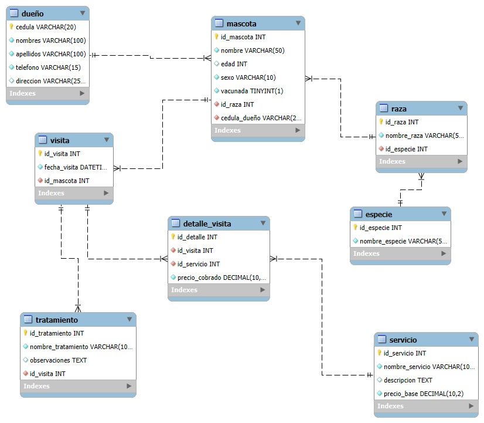

# Veterinaria "Mi Mejor Amigo" - Proyecto de Base de Datos

Este repositorio contiene la solución completa para el taller de diseño y manipulación de bases de datos relacionales, basado en el caso de la veterinaria "Mi Mejor Amigo".

El objetivo principal del proyecto es crear una base de datos normalizada y funcional que permita al personal administrativo de la veterinaria gestionar de manera eficiente la información de dueños, mascotas, servicios, visitas y tratamientos.

## 📂 Estructura del Proyecto

El proyecto está compuesto por los siguientes archivos SQL:

-   `estructura.sql`: **(DDL - Lenguaje de Definición de Datos)**. Contiene las sentencias `CREATE TABLE` para construir toda la estructura de la base de datos, incluyendo tablas, llaves primarias y foráneas.
    
-   `datos.sql`: **(DML - Lenguaje de Manipulación de Datos)**. Contiene las sentencias `INSERT INTO` para poblar la base de datos con un conjunto de datos de ejemplo que cumplen con los requisitos del taller.
    
-   `consultas.sql`: **(DQL - Lenguaje de Consulta de Datos)**. Contiene más de 15 consultas que demuestran cómo extraer información valiosa de la base de datos, aplicando diferentes funciones, uniones y técnicas de SQL.
    

## ⚙️ Proceso de Desarrollo

El desarrollo del proyecto se llevó a cabo siguiendo un proceso estructurado en cuatro fases principales:

1.  **Análisis y Diseño Conceptual:** Se analizaron los requerimientos funcionales para identificar las entidades principales (`Dueño`, `Mascota`, `Servicio`, `Visita`, `Tratamiento`). A partir de esto, se diseñó un modelo Entidad-Relación, el cual fue normalizado para garantizar la integridad de los datos y eliminar la redundancia.
    
2.  **Creación de la Estructura (DDL):** Se tradujo el diagrama Entidad-Relación a código SQL. Se escribieron las sentencias `CREATE TABLE` para cada entidad, definiendo los tipos de datos apropiados, las llaves primarias (`PRIMARY KEY`) y las relaciones a través de llaves foráneas (`FOREIGN KEY`).
    
3.  **Inserción de Datos (DML):** Una vez creada la estructura, se procedió a poblar las tablas con datos de prueba. Se crearon registros para cada tabla en un orden lógico para respetar las restricciones de integridad referencial, cumpliendo con las cantidades mínimas solicitadas en el taller.
    
4.  **Consultas y Explotación de Datos (DQL):** Finalmente, se diseñó un completo set de consultas para verificar la funcionalidad de la base de datos y demostrar cómo se puede extraer información útil que responda a preguntas de negocio, como el historial de una mascota, los servicios más solicitados o el total gastado por un cliente.
    

## 📊 Diseño de la Base de Datos

### Diagrama Entidad-Relación (E-R)

A continuación, se muestra el diseño visual de la base de datos.

        

### Descripción del Modelo Normalizado

El diseño de la base de datos se ha normalizado para optimizar su estructura y eficiencia:

-   **Tablas de Catálogo:** Se crearon las tablas `especie` y `raza` para evitar la escritura manual de estos datos en la tabla `mascota`, previniendo así errores de tipeo y manteniendo la consistencia.
    
-   **Relación N:M (Muchos a Muchos):** Se identificó que una `Visita` podría incluir varios `Servicios` (ej. baño y corte de uñas en la misma cita). Para manejar esto correctamente, se creó la tabla intermedia `detalle_visita`, que resuelve la relación N:M entre `visita` y `servicio`.
    
-   **Integridad Referencial:** Todas las relaciones se implementaron con llaves foráneas, asegurando que no se puedan crear registros huérfanos (por ejemplo, una mascota sin un dueño asociado).
    

## 🚀 Cómo Ejecutar el Proyecto

Para recrear la base de datos y ejecutar las consultas, sigue estos pasos en orden en tu gestor de bases de datos preferido (MySQL Workbench, DBeaver, etc.):

1.  Crea una nueva base de datos. Puedes usar el comando `CREATE DATABASE veterinaria_mi_mejor_amigo;`.
    
2.  Ejecuta el contenido completo del archivo `estructura.sql` para crear todas las tablas.
    
3.  Ejecuta el contenido completo del archivo `datos.sql` para poblar las tablas.
    
4.  Ejecuta las consultas del archivo `consultas.sql` una por una para ver los resultados.
    

## 📹 Video Explicativo

Se ha preparado un video que explica el proceso de desarrollo, el diseño de la base de datos y la ejecución de las consultas más importantes.

    

[Ver video explicativo del proyecto](https://drive.google.com/drive/folders/1cTanRFQ9GpemuLJAyxH06vRARooWmElj)

**Desarrollado por:**  Yhwrr Suárez